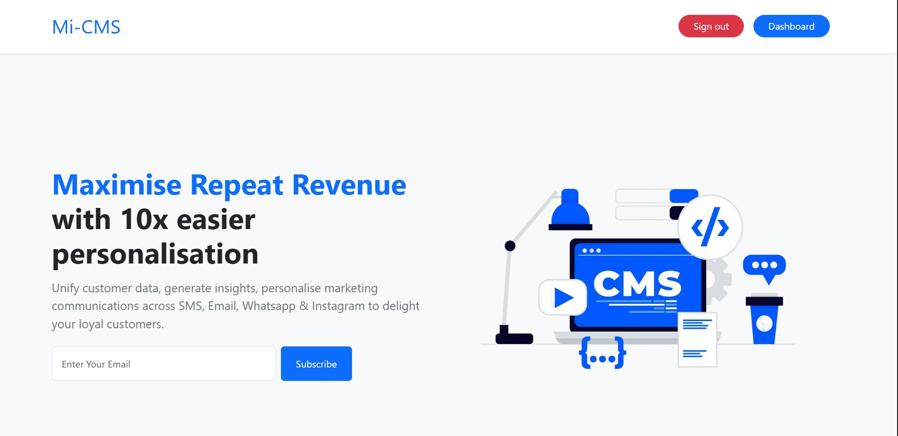
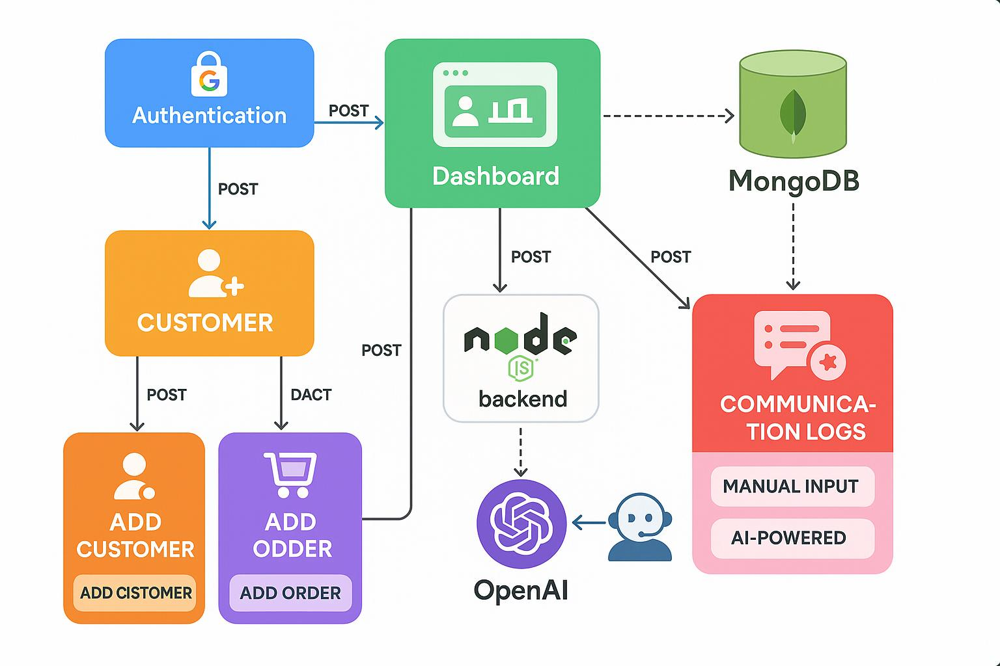

## 🖼 Preview



# Mi-CMS (Mini CRM Platform)

Mi-CMS is a Mini CRM Platform designed to enable efficient **customer segmentation**, **personalized campaign delivery**, and **intelligent insights** using modern technologies and approaches. It consists of a full-stack web application built using **Vite + React** on the frontend and **Node.js + Express** on the backend, integrated with MongoDB and OpenAI APIs.

---

## ✨ Features

- Customer segmentation using behavior and profile data
- Personalized marketing campaign delivery
- Intelligent insights using AI
- Google OAuth login support
- Modern React + Vite frontend setup

---

## 🛠️ Tech Stack

**Frontend:** React (Vite)  
**Backend:** Node.js, Express  
**Database:** MongoDB  
**Authentication:** Google OAuth 2.0  
**AI Integration:** OpenAI API

---

## 🚀 Local Setup Instructions

Follow these steps to set up Mi-CMS on your local development machine:

### 1. Clone the Repository

```bash
git clone https://github.com/yourusername/mi-cms.git
cd mi-cms
```

### 2. Backend Setup

```bash
cd backend
npm install
```

Create a .env file inside the backend folder with the following content:

```bash
MONGO_URL=mongodb://localhost:27017/myapp_db
SESSION_SECRET=your_very_strong_secret_here
PORT=5000
GOOGLE_CLIENT_ID=your_id
GOOGLE_CLIENT_SECRET=your_secret
GOOGLE_CALLBACK_URL=http://localhost:5000/auth/google/callback
FRONTEND_URL=http://localhost:5173
OPENAI_API_KEY=your-key

```

Start the backend server

```bash
node server.js
```

The backend will be running at: http://localhost:5000

### 3. Frontend Setup

```bash
cd ../frontend
npm install

```

Create a .env file inside the frontend folder with the following content:

```bash
VITE_API_URL=http://localhost:5000

```

Start the frontend server

```bash
npm run dev
```

The frontend will be available at: http://localhost:5173

### 4. Architecture Diagram



The architecture of **Mi-CMS** is designed to ensure modularity, scalability, and AI-driven insights. Below is the high-level diagram of the system:

### 🔍 Key Components:

- **Authentication**  
  Google OAuth is used for secure login.

- **Dashboard**  
  Central control panel that interacts with all major services.

- **Customer Module**  
  Handles adding and managing customer information.

- **Order Module**  
  Lets users add customer orders.

- **Backend (Node.js)**  
  Acts as the main API server, orchestrating communication between the frontend, database, and AI services.

- **MongoDB**  
  Used to store all structured data like customers, orders, and logs.

- **Communication Logs**  
  Records customer interactions—either manually entered or AI-generated—for deeper insights.

- **OpenAI Integration**  
  Powers smart suggestions, insights, and personalized communication based on logs and customer profiles.

### 5. Summary of AI Tools and Other Technologies Used

- **Frontend:** Built with **React** for a dynamic and responsive user interface.

- **Backend:** Developed using **Express** framework on **Node.js**, serving as the main API server.

- **Database:** **MongoDB** is used to store all structured data including customers, orders, and logs.

- **AI:** Integrated with the **OpenAI API** to provide smart suggestions, insights, and personalized communication.

- **CSS Framework:** **Bootstrap** is used for styling and to ensure a clean, responsive design.

### 6. Known limitations or assumptions

- **Does not work in browsers (like Brave) where third-party cookies are blocked.** Google OAuth and session management require third-party cookies to be enabled for authentication to work reliably.
- **Campaign audience is not updated when new customers are added to the database.** Once a campaign is created, its audience is fixed and does not reflect new customers who match the segment criteria.
- **No email/SMS delivery integration.** Communication logs are recorded in the system, but actual sending of emails or SMS messages is not implemented.
- **No role-based access control.** All authenticated users have the same permissions; there is no admin/user separation or granular access control.
- **AI-generated queries may require manual review.** The OpenAI-powered NLP-to-query feature may sometimes generate queries that need manual adjustment, especially for complex or ambiguous descriptions.
- **No pagination or performance optimization for large datasets.** The dashboard loads all customers and orders at once, which may impact performance with large data volumes.
